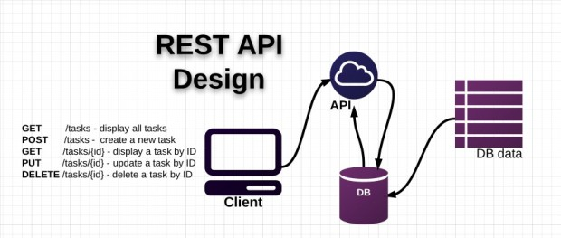

# Web Service

- Web Service là tập hợp các giao thức và tiêu chuẩn mở được sử dụng để trao đổi dữ liệu giữa các ứng dụng hoặc giữa các hệ thống. Tóm gọm

  - Là phương thức giao tiếp giữa hai thiết bị qua mạng.
  - Là ứng dụng hoặc thành phần ứng dụng để giao tiếp.
  - Là tập hợp các tiêu chuẩn hoặc giao thức để trao đổi thông tin giữa hai thiết bị hoặc ứng dụng.

- Các ứng dụng phần mềm được viết bằng các ngôn ngữ lập trình khác nhau và chạy trên các nền tảng khác nhau, có thể sử dụng Web Service để trao đổi dữ liệu qua mạng máy tính.
   

    
  

> (personal note) Hiểu đơn giản: Web Service là 1 ứng dụng hoặc 1 thành phần ứng dụng giúp các ứng dụng phần mềm trao đổi dữ liệu qua mạng máy tính mà KHÔNG quan tâm tới đầu vào (viết bằng ngôn ngữ lập trình nào, chạy trên nền tảng nào, ...) 
- Có hai loại web service chủ yếu:
  - SOAP web service.
  - RESTful web service.

## 1. SOAP Web Service

- SOAP là viết tắt của Simple Object Access Protocol, có nghĩa là giao thức truy cập đối tượng đơn giản. Được phát triển bởi Microsoft, ...

- SOAP là một đặc tả giao thức nhắn tin để trao đổi thông tin có cấu trúc trong việc triển khai các dịch vụ web trong mạng máy tính. Nó sử dụng tập thông tin XML cho định dạng thông báo và dựa trên các giao thức lớp ứng dụng, thường là Giao thức truyền siêu văn bản (HTTP) hoặc Giao thức truyền thư đơn giản (SMTP), để đàm phán và truyền thông.

  > Nó là một giao thức dựa trên XML để truy cập các web services.

## 2. RESTful Web Service

- REST (REpresentational State Transfer) là một dạng chuyển đổi cấu trúc dữ liệu, một kiểu kiến trúc để viết API. Nó sử dụng phương thức HTTP đơn giản để tạo cho giao tiếp giữa các máy.
- RESTful (REpresentational State Transfer) là một kiểu Web Service được viết dựa trên kiến trúc REST.
- Các đặc điểm của RESTful web service:
  - Sử dụng các phương thức HTTP/HTTPs
  - Phi trạng thái (stateless) (không lưu trữ thông tin của client)
  - Hiển thị cấu trúc thư mục như các URls
  - Truyền tải dữ liệu với định dạng phong phú: html, json, text, xml… (thường sử dụng nhiều với json)

### 2.1. Các HTTP Method mà RESTful hỗ trợ

- Method GET: được sử dụng để truy vấn, lấy dữ liệu từ server. Request sử dụng method GET chỉ nên sử dụng để lấy dữ liệu, không nên chỉnh sửa/tác động tới dữ liệu
- Method HEAD: giống như method GET nhưng chỉ nhận về status và header, không nhận về body
- Method POST: được sử dụng để gửi dữ liệu tới server, tạo mới tài nguyên, ví dụ upload file, đăng nhập, …
- Method PUT: được dùng để cập nhật cho tài nguyên (ví dụ update cả đối tượng user)
- Method PATCH: giống như method PUT nhưng chỉ cập nhật cho 1 phần dữ liệu (ví dụ chỉ update thông tin 1 thuộc tính của user)
- Method DELETE: được dùng cho hành động xóa đối tượng trên server.
- Một số method khác: CONNECT (thiết lập một kết nối tới server theo URI.), OPTIONS (mô tả các tùy chọn giao tiếp cho resource.), TRACE (thực hiện một bài test loop – back theo đường dẫn đến resource.)

### 2.2. Bảo mật, xác thực trong RESTful Web Service

- Request trong web service là stateless, nó cũng không sử dụng cookies nên ta không thể lưu thông tin đăng nhập vào session.

- Để xác thực trong RESTful web service, sau khi đăng nhập client sẽ nhập được 1 token, mỗi lần gửi request sẽ gửi kèm token đó vào header của request. Server sẽ dựa vào token để xác thực client.
  

## 3. SOAP vs RESTful

- SOAP chỉ trả về dữ liệu dạng XML còn RESful trả về dữ liệu ở nhiều định dạng khác nhau: Plain Text, HTML, XML and JSON…
- Tốc độ của RESTFul nhanh hơn SOAP
- SOAP có tính bảo mật và toàn vẹn hơn RESTful
- SOAP là một kiểu giao thức (protocol) na ná như HTTP, nó cũng có phần header, body… để định nghĩa dữ liệu gửi về còn RESTFul giống như 1 kiểu kiến trúc gửi/ nhận (client gửi request/dữ liệu tới, server trả dữ liệu tương ứng về)
- SOAP hỗ trợ cả hai giao thức SMTP, HTTP, ... còn REST gắn với giao thức HTTP

# API

- Là viết tắt của Application Programming Interface – giao diện lập trình ứng dụng
- Là tập các hàm hoặc lệnh
  - được Web Service cung cấp
  - sử dụng để truy xuất dữ liệu qua lại request và response
    > API là một tập các quy tắc và cơ chế mà theo đó, một ứng dụng hay một thành phần sẽ tương tác với một ứng dụng hay thành phần khác

## 1. RESTful API

- RESTful API là một tiêu chuẩn dùng trong việc thiết kế các API cho các ứng dụng web để quản lý các resource. RESTful là một trong những kiểu thiết kế API được sử dụng phổ biến ngày nay để cho các ứng dụng (web, mobile…) khác nhau giao tiếp với nhau.
  
