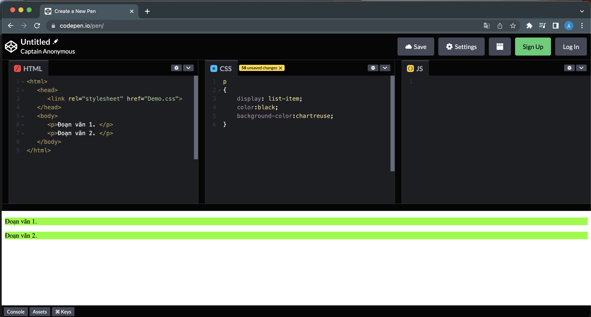

# **CSS DISPLAY PROPERTY**

- Thuộc tính `display` là thuộc tính quan trọng nhất của CSS được sử dụng để kiểm soát bố cục của phần tử. Nó chỉ định cách các phần tử được hiển thị.

- Mỗi phần tử HTML có giá trị hiển thị mặc định tùy thuộc vào loại phần tử. Mỗi phần tử trên trang web là một hộp hình chữ nhật (rectangle box) và thuộc tính CSS xác định hành vi của hộp hình chữ nhật đó. Giá trị hiển thị mặc định cho hầu hết các phần tử là `block` (khối) hoặc `inline` (nội tuyến)
- Chỉ cần thiết lập lại giá trị cho thuộc tính display của phần tử thì có thể thay đổi cách thức hiển thị của phần tử đó

- Cấu trúc
```Structure
tag {
    display: giá trị;
}
```

## **1. `display:block;`**
Phần tử hiển thị dưới dạng khối (đứng một hàng độc lập so với phần tử trước và sau nó).


## **2. `display:inline;`**
Phần tử sẽ hiển thị dưới dạng nội tuyến (không ngắt dòng khi chiều rộng vẫn nhỏ hơn chiều rộng của màn hình).


## **3. `display:inline-block;`**
Phần tử sẽ hiển thị dưới dạng khối nội tuyến (phần tử hiển thị tiếp nối trên hàng hiện tại, có thể sử dụng các thuộc tính width & height để thiết lập lại kích thước cho phần tử).


## **4. `display:inline-table;`**
Phần tử hiển thị dưới dạng khối nột tuyến. Không xuống dòng trước và sau các thành phần cạnh nó.


## **5. `display:list-item;`**
Cách thức hiển thị của phần tử sẽ giống với một phần tử `<li>.`



## **6. `display:table;`**
Cách thức hiển thị của phần tử sẽ giống với một phần tử `<table>.`


## **8. `display:none;`**
Xóa phần tử và tất cả các con của nó khỏi trang. 


## **9. Các giá trị khác của `display`**


