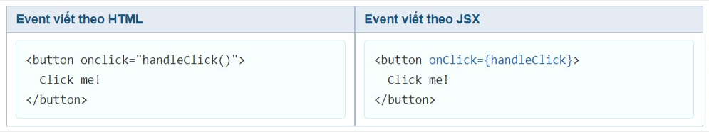

# Props - State - Handling Events

---

## I. Props

- React Elements
  - Sử dụng props giống như với attribute của thẻ HTML
  - 2 props class, for => className, htmlFor
  - Phải tuân theo quy ước có sẵn
- React Components
  - Sử dụng prop2s giống như đối số cho Component
  - Tự do đặt tên props
  - Đặt theo camelCase
  - Có thể bao gồm dấu gạch ngang
    > Chú ý:
    >
    > - Prop "key" là prop đặc biệt
    > - Props cơ bản là đối số cho Component
    >   => Props có thể là bất cứ kiểu dữ liệu gì
    > - Sử dụng destructuring

## II. State

### 1. State trong ReactJS là gì

- State là một object có thể được sử dụng để chứa dữ liệu hoặc thông tin về components. State có thể được thay đổi bất cứ khi nào mong muốn. Khác với props bạn có thể truyền props sang các components khác nhau thì state chỉ tồn tại trong phạm vi của components chứa nó, mỗi khi state thay đổi thì components đó sẽ được render lại.

-Trong các dự án React, state được dùng để phản hồi các yêu cầu từ người dùng, hay lưu trữ một dữ liệu nào đó trong components.

### 2. Thao tác với state trong ReactJS

#### 2.1 Khởi tạo 1 state

-Chúng ta có thể khởi tạo một state bằng cách gán giá trị cho biến `this.state`:

```javascript
this.state = { name: "value" };
```

- Trong hầu hết các trường hợp bạn nên khởi tạo state bên trong hàm `constructor()` để tránh gặp các lỗ không mong muốn. Vì đây sẽ là hàm khởi chạy đầu tiên khi một components được gọi.

#### 2.2 Cập nhật 1 state

- Để cập nhật một state bạn sử dụng phương thức:

```javascript
this.setState({
  name: "newValue",
});
```

- Ngoài ra bạn cũng có thể lấy giá trị của state trước khi cập nhật:

```javascript
this.setState((state) => {
  return newValue;
});
```

### 3. Sự khác nhau giữa Props và State

- State: Dữ liệu chỉ nằm trong phạm vi của một component. Nó được sở hữu bởi một components cụ thể mà chỉ là của component đó thôi. Và mỗi khi state thay đổi thì component cũng phải thay đổi theo.
- Props: Dữ liệu đường truyền từ component cha cho componet con, components con khi nhận được sẽ chỉ được đọc mà không thể thay đổi dữ liệu đó.

## III. useState Hook

### 1. Hook

- Hooks mới được thêm ở phiên bản React 16.8. Hooks cho phép bạn sử dụng state và các features khác của React mà không cần tạo class

### 2. useState()

Việc sử dụng useState() cho phép chúng ta có thể làm việc với state bên trong functional component mà không cần chuyển nó về class component.

#### 2.1. Syntax

`const [tenSate, hamCapNhatState] = useState(giaTriBanDauCuaState);`

#### 2.2. Import, Initialize, Read & Update State

```javascript
import React, { useState } from "react";

function Example() {
  // Declare a new state variable, which we'll call "count"
  const [count, setCount] = useState(0);

  return (
    <div>
      <p>You clicked {count} times</p>
      <button onClick={() => setCount(count + 1)}>Click me</button>
    </div>
  );
}
```

- Tại đây, `useState` là một Hook. Chúng ta gọi nó trong một function component để thêm local state cho nó. React sẽ giữ trạng thái này giữa các lần re-render. `useState` trả về một cặp: giá trị state hiện tại và một hàm cho phép bạn cập nhật trạng thái đó. Bạn có thể gọi hàm này từ một event handler hoặc nơi nào đó khác. Nó tương tự như `this.setState` trong một class, ngoại trừ việc nó không gộp trạng thái cũ với trạng thái mới.

- Đối số duy nhất của `useState` là trạng thái khởi tạo. Trong ví dụ trên, nó là 0 bởi vì `count` của chúng ta bắt đầu từ 0.
  > Chú ý rằng không giống `this.state`, trạng thái ở đây không cần phải là 1 đối tượng — mặc dù nó có thể nếu bạn muốn. Đối số trạng thái khởi tạo chỉ sử dụng trong lần render đầu tiên.

## III. Handling Events

### 1. Thêm sự kiện

- Giống như các events HTML DOM, React có thể thực hiện các hành động dựa trên các events của người dùng. React có các events tương tự như HTML: click, change, mouseover v.v.
- Một số khác biệt về cú pháp với xử lý các sự kiện trên các phần tử DOM:

  

  - Các sự kiện React được đặt tên bằng camelCase, thay vì chữ thường.
  - Với JSX, bạn truyền một hàm để bắt sự kiện, thay vì một chuỗi như HTML thông thường.
    > - Khi bạn khai báo `handleClick()` thì function sẽ được gọi khi render.
    > - Khi bạn khai báo `handleClick` thì function sẽ được gọi khi button được click.
    > - Để tránh tình trạng trên thì mình sẽ sử dụng hàm anonymous functions (`onClick={() => handleClick()}`) để gọi `handleClick`
  - Một điểm khác biệt nữa trong React là bạn không thể trả về `false` để chặn những hành vi mặc định mà phải gọi `preventDefault` trực tiếp.

    - Lấy ví dụ với đoạn HTML sau, để chặn hành vi mặc định của đường dẫn là mở trang mới, bạn có thể viết:

    ```html
    <form onsubmit="console.log('You clicked submit.'); return false">
      <button type="submit">Submit</button>
    </form>
    ```

    - Còn trong React, bạn có thể làm như thế này:

    ```javascript
    function Form() {
      function handleSubmit(e) {
        e.preventDefault();
        console.log("You clicked submit.");
      }

      return (
        <form onSubmit={handleSubmit}>
          <button type="submit">Submit</button>
        </form>
      );
    }
    ```

### 2. Truyền tham số vào hàm bắt sự kiện

- Cách 1: Dùng Arrow Function
- Cách 2: Dùng bind để truyền tham số
  - Bind tham số trực tiếp ở hàm
  - Bind tham số ở hàm constructor
